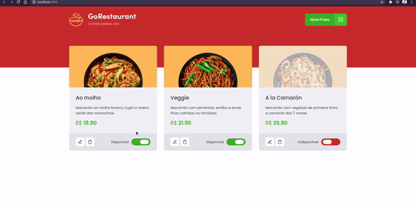

<h1 align="center">
  GoRestaurant
</h1>

Este desafio tem como objetivo refatorar o projeto, realizando dois processos de migração: de Javascript para Typescript e de Class Components para Function Components.

## 👀 Requisitos
- [x] Converter arquivos de Javascript para Typescript;
- [x] Converter componentes de classe para funções.

## 💻 Aplicação

## 🌠 Extras
Para mais detalhes sobre o desafio, acesse [esse link](https://www.notion.so/Desafio-02-Refactoring-de-classes-e-typescript-4571541e7f8c4799bd191b6cfb53802c).